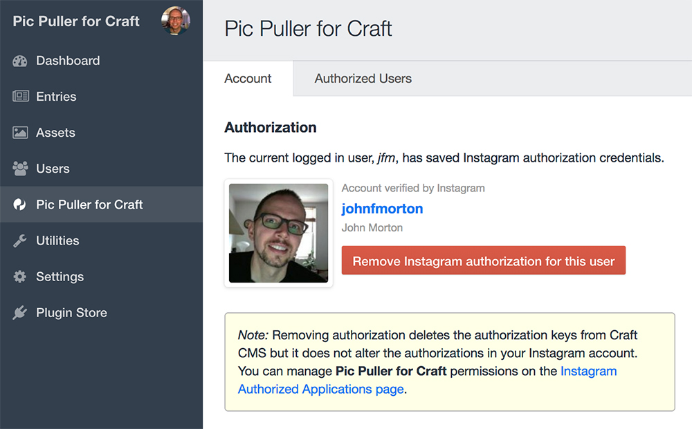

# Pic Puller plugin for Craft CMS 3.x

Integrate Instagram into Craft CMS.

## Requirements

This plugin requires Craft CMS 3.0.0-RC1 or later.

## Installation

To install the plugin, follow these instructions.

1. Open your terminal and go to your Craft project:

        cd /path/to/project

2. Then tell Composer to load the plugin:

        composer require jmx2/pic-puller

3. In the Control Panel, go to Settings → Plugins and click the “Install” button for Pic Puller.

## Pic Puller Overview

Pic Puller integrates Instagram into Craft CMS. *Pic Puller for Craft* is an approved Instagram app that exposes the Instagram API into Craft with easy-to-use Twig variables.

## Configuring Pic Puller

See _PicPullerDocumentation.md_ for full documentation.

Brought to you by [John F Morton](https://picpuller.com)
